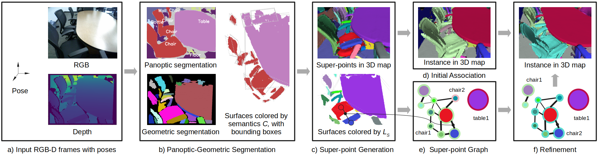

# Panoptic SLAM with semantic and geometric consistency

**"Panoptic SLAM with semantic and geometric consistency"** is a pipeline for simultaneously estimate image poses and incrementally building volumetric object-centric maps during online scanning with a localized RGB-D camera. The framework is divided into two parts: mapping and semantic-aided localization.

## 2D-3D Semantic Mapping Part
<div align='center'>
<h2 align="center"> Volumetric Semantically Consistent 3D Panoptic Mapping </h2>

<a href="https://y9miao.github.io/">Yang Miao</a><sup>1</sup>, 
<a href="https://ir0.github.io/">Iro Armeni</a><sup>1, 2</sup>, 
<a href="https://cvg.ethz.ch/team/Prof-Dr-Marc-Pollefeys"> Marc Pollefeys</a><sup>1, 3</sup>, 
<a href="https://cvg.ethz.ch/team/Dr-Daniel-Bela-Barath"> Dániel Béla Baráth</a> <sup>1</sup>

<sup>1</sup>ETH Zurich   <sup>2</sup>Stanford University <sup>3</sup>Microsoft



In this part, we introduce an online 2D-to-3D semantic instance mapping algorithm aimed at generating comprehensive, accurate, and efficient semantic 3D maps suitable for autonomous agents in unstructured environments. The proposed approach is based on a Voxel-TSDF representation used in recent algorithms. It introduces novel ways of integrating semantic prediction confidence during mapping, producing semantic and instance-consistent 3D regions. Further improvements are achieved by graph optimization-based semantic labeling and instance refinement.

</div>

The code framework is based on [**Voxblox++**](https://github.com/ethz-asl/voxblox-plusplus).
The main difference against **Voxblox++** is: 
<ol>
  <li> <a href="[https://github.com/facebookresearch/detectron2](https://github.com/facebookresearch/Mask2Former)">Panoptic segmentation</a> is applied in 2D RGB images instead of <a href="https://github.com/matterport/Mask_RCNN2">instance segmentation.</a></li>
  <li>A novel method to segment semantic-instance surface regions(super-points), as illustrated in Section III-B in the paper.</li>
  <li>A new graph optimization-based semantic labeling and instance refinement algorithm, as illustrated in Section III-C & Section III-D in the paper.</li>
  <li>The proposed framework achieves state-of-the-art 2D-to-3D instance segmentation accuracy, as illustrated in Section IV in the paper.</li>
</ol>
<!-- 
<p align="center">
  
</p>   -->

### Getting started
- [Installing on Ubuntu](https://github.com/y9miao/volumetric-semantically-consistent-3D-panoptic-mapping/wiki/Installation)
- [Datasets](https://github.com/y9miao/volumetric-semantically-consistent-3D-panoptic-mapping/wiki/Datasets)
- [Basic usage](https://github.com/y9miao/volumetric-semantically-consistent-3D-panoptic-mapping/wiki/Basic-Usage)

### Some Implementation details
- For experiments shown in Table II and III, we use 18 instance classes(excluding wall and floor) of [NYU20 labels](https://kaldir.vc.in.tum.de/scannet_benchmark/labelids.txt) for evaluation.
- As the pretrained model from Mask2former outputs CoCoPano classes. We fintune the model in train set of [ScanNet Dataset](https://kaldir.vc.in.tum.de/scannet_benchmark)so that it can output semantic labels in NYU40 space. The finetuned model can be download [here](https://drive.google.com/file/d/1vHszTmSo7HGZFHJHF7QAhazOI9NcuRdv/view?usp=sharing).
- In order for fair comparison, the **Voxblox++** and **Han et al** in the paper use the finetuned Mask2former model for panoptic segmentation instead of their orginal ones. 

### Citing
The framework is described in the following publication:

- Yang Miao, Iro Armeni, Marc Pollefeys, Daniel Barath, ***"Volumetric Semantically Consistent 3D Panoptic Mapping"***, **IROS 2024 (<span style="color: red;">Oral Presentation</span>)**. [[PDF](https://arxiv.org/abs/2309.14737)] [[Video](https://youtu.be/A3aY7pdYAa4)]


```bibtex
@misc{miao2023volumetric,
      title={Volumetric Semantically Consistent 3D Panoptic Mapping}, 
      author={Yang Miao and Iro Armeni and Marc Pollefeys and Daniel Barath},
      year={2023},
      eprint={2309.14737},
      archivePrefix={arXiv},
      primaryClass={cs.RO}
}
```

If you use our work in your research, please cite accordingly.

## Semantic-aided Localization Part 
Apart from 2D-3D semantic mapping, this project also explores semantic-aided localization.
The code of the semantic-aided localization has been released!

### TODO
- ~~Update the code of semantic-aided localization~~   
- Update the demo of semantic-aided localization
<!-- - Integrate the graph-based optimization part into online mapping pipeline -->

